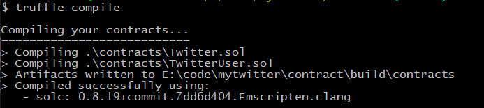
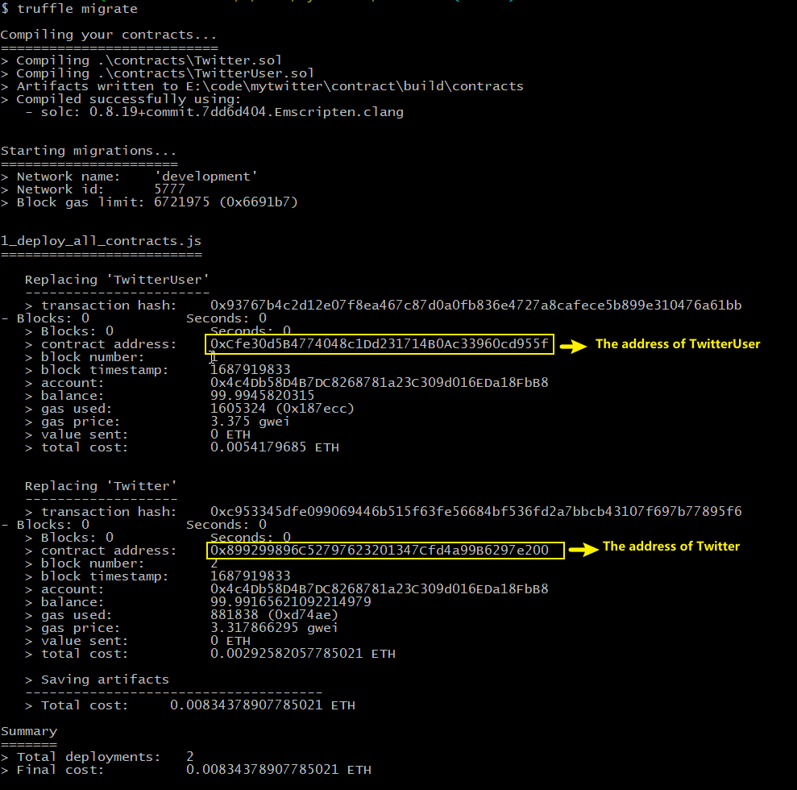
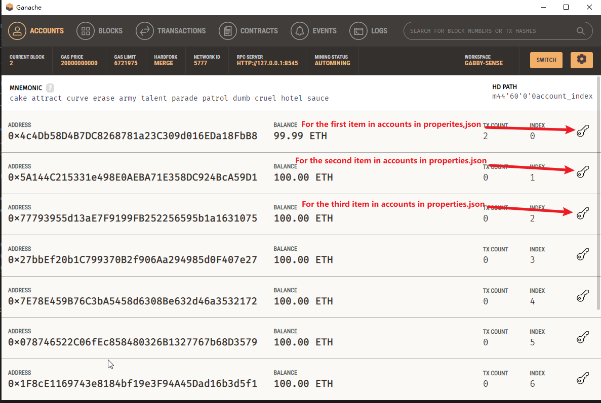

# The distributed twitter
Build a distirbuted twitter using go and ethereum blockchain

# Tech stack used in this project
- gin - Http web framework
- fx : A dependency injection system
- koanf : a simple, extremely lightweight, extensible, configuration management library
- cobra : A CLI application
- zap : A fast, structured, leveled logging
- Solidity - Smart contract programming language
- golang - A popuplar programming language
- truffle & ganache - tools used to debug&deploy solidity
- Javascript - scripts used to build/deploy smart contracts

# How to run codes
 - Install ganache and truffle 
 - Start ganache
 - Deploy smart contracts
 - Generate go-binding for all smart contracts(Optional)
 - Start Web server
 - Send restful requests

# Install ganache and truffle 
  Visit the official weibsite to check how to install ganache and truffle: https://trufflesuite.com/docs/truffle/
# Start ganache

  Using ganache UI to start ganache.

  In the new workspace, give the following settings:
  - In WORKSPACE tab, set WORKSPACE NAME: twitter
  - In WORKSPACE tab, set TRUFFLE PROJECTS: Add contract/truffle-config.js by clicking [ADD PROJECT] button
  - In SERVER tab, set PORT NUMBER as 8575
  - In ACCOUNT & KEY tab, set Mnemonic to be "cake attract curve erase army talent parade patrol dumb cruel hotel sauce"

  Leave the rest of settings as default values

# Deploy smart contracts
Enter the contract folder, run the following commands on the console:
1. Compile contracts
```
 truffle compile
```

2. Deploy contract
```
truffle migrate
```


# Generate go-binding for all smart contracts(Optional)
 Run the following commands to generate go-binding files for contracts
- Build abigen tool
Download ethereum source code and build like below
```
cd go-ethereum
go build ./cmd/abigen
```
- Generate go-binding files: TwitterUser.go for TwitterUser.sol and Twitter.go for Twitter.sol
Enter contract/contracts folder, run the following commands:
```
solcjs --abi TwitterUser.sol -o build
solcjs --bin TwitterUser.sol -o build
abigen --abi ./build/TwitterUser_sol_TwitterUser.abi --pkg twitterapi --type TwitterUser --out TwitterUser.go --bin ./build/TwitterUser_sol_TwitterUser.bin

solcjs --abi Twitter.sol -o build
solcjs --bin Twitter.sol -o build
abigen --abi ./build/Twitter_sol_Twitter.abi --pkg twitterapi --type Twitter --out Twitter.go --bin ./build/Twitter_sol_Twitter.bin
```
Copy Twitter.go and TwitterUser.go to twitterApi folder(You don't need to copy them, because I've put the copies under twitterApi folder)
# Start Web server
## Modify config file before starting the web server
Open config/properties.json
Edit 3 items: accounts, twitterUserAddr and twitterAddr
- accounts
 For the first item in accounts, key is the key of the first account generated by ganache, address is the address of that first account.
 The second item in accounts is for the second account.
 The third item in accounts is for the third account.
 (For simplicity, don't change name for all these 3 items above)
 


- twitterUserAddr
  Set the value to be the address of the contract TwitterUser, which is 0xCfe30d5B4774048c1Dd231714B0Ac33960cd955f in this case (In your env, the address of TwitterUser is different from here)
- twitterAddr
  Set the value to be the address of the contract Twitter, which is 0x899299896C52797623201347Cfd4a99B6297e200 in this case (In your env, the address of TwitterUser is different from here)
## Download dependences
```
go get github.com/ethereum/go-ethereum
go get github.com/ethereum/go-ethereum/accounts/abi/bind 
go get github.com/knadh/koanf
go get github.com/gin-gonic/gin
go get go.uber.org/fx
go get github.com/spf13/cobra
```
## Start web server
Run one of the three commands below to start a web server:
```
.\go-microservice-template.exe
.\go-microservice-template.exe server -c "./config/properties.json"
.\go-microservice-template.exe -c "./config/properties.json"
```
# Send Restful requests (user cases)
## Register users
In postman, send 2 requests with http://127.0.0.1:8080/api/admin/users (POST)

For the first request, request body in the form of json is below:
```
{
    "name" : "user1",
    "password" : "123456"
}
```
The response returned contains the transaction hash code of this request:
```
{
    "code": 200,
    "message": "success",
    "details": {
        "tx": "0x365c5c91a030239161df716e395025ee68ce0de522f4f4dd66ac177e4769fd1b"
    }
}
```

For the second request, request body in the form of json is below:
```
{
    "name" : "user2",
    "password" : "78910"
}
```
The response returned contains the transaction hash code of this request:
```
{
    "code": 200,
    "message": "success",
    "details": {
        "tx": "0xeb0cde103269be03b9bd6ed94792af72a303588ab5db95819d52d4b87c73f529"
    }
}
```
## Check registered user info
In postman, send 2 requests.
First request: with http://127.0.0.1:8080/api/admin/users/user1 (GET)
We see response:
```
{
    "code": 200,
    "message": "success",
    "details": {
        "isLogin": false,
        "name": "user1"
    }
}
```

Second request: with http://127.0.0.1:8080/api/admin/users/user2 (GET)
We see response:
```
{
    "code": 200,
    "message": "success",
    "details": {
        "isLogin": false,
        "name": "user2"
    }
}
```

## Login
In postman, send one request to login with http://127.0.0.1:8080/api/admin/users (PUT)
Request body is like below:
```
{
    "name" : "user1",
    "password" : "123456"
}
```
We see reponse:
```
{
    "code": 200,
    "message": "success",
    "details": {
        "tx": "0x113461bf8a5cee27edc70542f3f7150ca1fef3abdf7537e2edb2ce8572700615"
    }
}
```
Once user1 logined successfully, we send this request to verify the info of user1:
http://127.0.0.1:8080/api/admin/users/user1 (GET)
We get reponse like below:
```
{
    "code": 200,
    "message": "success",
    "details": {
        "isLogin": true,
        "name": "user1"
    }
}
```
We notice that the value of "isLogin" for user1 became true
## Check the number of registered users
Let's check how many users have registered.
We send the request with http://127.0.0.1:8080/api/admin/users (GET)
We get reponse like below:
```
{
    "code": 200,
    "message": "success",
    "details": {
        "users": 2
    }
}
```
The response indicates there are 2 users registered. That's correct because we only registered 2 users in the previous steps
## Post message by one logined user
In postman, send 2 requests by one user to post messages with http://127.0.0.1:8080/api/twitter/posts  (POST)
For the first request, request body in the form of json is below:
```
{
    "name" : "user1",
    "message" : "message1-1"
}
```
The response for the first request like below:
```
{
    "code": 200,
    "message": "success",
    "details": {
        "tx": "0xfb1c3aba8531cefe48c0770214d4477691d581a8663c6fe6e96a35a6472299ef"
    }
}
```
For the second request, request body in the form of json is below:
```
{
    "name" : "user1",
    "message" : "message1-2"
}
```
The response for the second request like below:
```
{
    "code": 200,
    "message": "success",
    "details": {
        "tx": "0x00cbe50d588a35ea1fbc137c9fc72ca80f1fecbfe7a403fa796daf0c3e0d52e4"
    }
}
```
## Check the number of posts by that logined user
Send the request to check the number of posts posted by user1: http://127.0.0.1:8080/api/twitter/posts/user1 (GET)
The response:
```
{
    "code": 200,
    "message": "success",
    "details": {
        "posts": 2
    }
}
```
We see that the response indicates there are 2 posts for user1, which is correct
## Read the content of one post posted by that logined user
Since user1 has posted 2 posts. Let's check the details for each post.
Check the first post with http://127.0.0.1:8080/api/twitter/posts/user1/0  (GET)
The reponse is:
```
{
    "code": 200,
    "message": "success",
    "details": {
        "message": "message1-1",
        "name": "user1",
        "timestamp": 1687954762
    }
}
```
The the content of the reponse for the first post is consistent with what we sent.

Check the second post with http://127.0.0.1:8080/api/twitter/posts/user1/1  (GET)
The reponse is:
```
{
    "code": 200,
    "message": "success",
    "details": {
        "message": "message1-2",
        "name": "user1",
        "timestamp": 1687954839
    }
}
```
The the content of the reponse for the second post is consistent with what we sent.

When we send the request to check the non-existing post for user1 with http://127.0.0.1:8080/api/twitter/posts/user1/2  (GET)
We will see nothing returned in the reponse
```
{
    "code": 200,
    "message": "success",
    "details": {
        "message": "",
        "name": "",
        "timestamp": 0
    }
}
```
## Post message by one unlogined user
Let's post a message by an unlogined user user2
Let's first check the status of user2 to make sure it is unlogined:
http://127.0.0.1:8080/api/admin/users/user2 (GET)
The response like this:
```
{
    "code": 200,
    "message": "success",
    "details": {
        "isLogin": false,
        "name": "user2"
    }
}
```
"isLogin" is false indicating that user2 is unlogined

Then let's send a request to post a message by user2:
http://127.0.0.1:8080/api/twitter/posts (POST) with the request body in the form of json like below:
```
{
    "name" : "user2",
    "message" : "message2-1"
}
```
The response is like below:
```
{
    "code": 400,
    "message": "failed",
    "details": "VM Exception while processing transaction: revert It is not logined"
}
```
It is what we expected
## Logout for the logined user
We know user1 is logined. Let's logout user1 with http://127.0.0.1:8080/api/admin/users/user1/unlogin (PUT)
The reponse is like this:
```
{
    "code": 200,
    "message": "success",
    "details": {
        "tx": "0x37b5abca60c67a2aaab12215fc7a78cef43997ade436bd6d788ddea60f618c00"
    }
}
```
Let's check the status of user1 with http://127.0.0.1:8080/api/admin/users/user1 (GET)
```
{
    "code": 200,
    "message": "success",
    "details": {
        "isLogin": false,
        "name": "user1"
    }
}
```
We notice that the value of isLogin became false, which is what we expected
## Unregister a register user
Let's unregister user1 with http://127.0.0.1:8080/api/admin/users/user1 (DELETE)
The response is like this:
```
{
    "code": 200,
    "message": "success",
    "details": {
        "tx": "0x658d754b71176991ce38ef5c6d64bcd5271efe7a4925244275793e4327b961f6"
    }
}
```
## Check the number of registered users after unregisteration
Let's check the number of users with http://127.0.0.1:8080/api/admin/users (GET)
```
{
    "code": 200,
    "message": "success",
    "details": {
        "users": 1
    }
}
```
We see that the value of users is 1 rather than 2

Thank you

